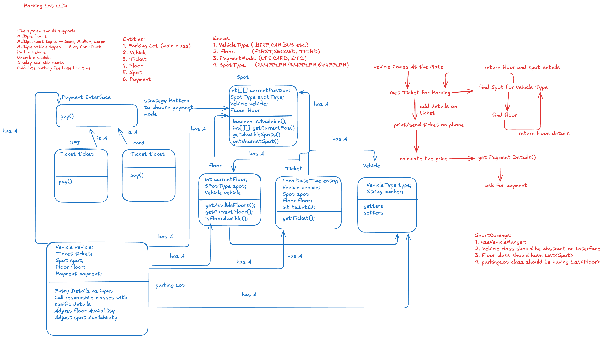
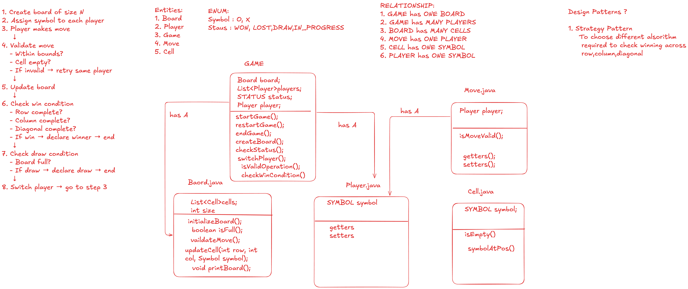

# LLD-Problems

A collection of Low-Level Design (LLD) problems implemented in Java, covering real-world system design scenarios and object-oriented design patterns.

---

## Problems

### 1. Parking Lot

**Class diagram:**

A fully functional parking lot system supporting multiple vehicle types, floors, and payment methods.

**Key features:**
- Multi-floor parking with typed spots (two-wheelers, four-wheelers, six-wheelers)
- Vehicle types: `Bike`, `Car`, `Truck` (created via `VehicleFactory`)
- Ticket generation on entry; automatic spot release on exit
- Payment methods: `CASH`, `CARD`, `UPI` — each with its own pricing strategy
- Strategy pattern for pluggable pricing per payment method

**Design patterns:** Strategy, Factory

**Package:** `parkinglot/`

---

### 2. Tic-Tac-Toe

**Class diagram:**

A console-based two-player Tic-Tac-Toe game with configurable board size.

**Key features:**
- `Board` with an `n×n` cell grid; defaults to 3×3
- `GameEngine` drives the turn loop, validates moves, and checks win/draw conditions
- Win detection across rows, columns, and both diagonals
- `Status` enum: `IN_PROGRESS`, `WIN`, `DRAW`
- Players choose symbols (`X` / `O`); move input via `Scanner`

**Package:** `tictactoe/`

---

### 3. Elevator System

**Class diagram:**

Skeleton design for an elevator control system with extensible interfaces.

**Key features:**
- Enums for `ElevatorStatus` (IDLE, MOVING_UP, MOVING_DOWN), `Direction`, `DoorStatus`, `RequestType`
- Interfaces defined for `Button`, `Display`, `ElevatorStrategy`, and `ElevatorState`
- Designed for pluggable dispatch strategies (e.g., SCAN/LOOK algorithm)

**Package:** `elevatorsystem/`

---

### 4. Chess Game

A class structure for a chess game representing pieces, players, and board state.

**Key features:**
- `Piece` holds `TypeOfPiece` (KING, QUEEN, ROOK, BISHOP, KNIGHT, PAWN), owner `Player`, and `Color`
- `Color` enum: `WHITE`, `BLACK`
- Clean separation between piece type and ownership

**Package:** `chessgame/`

---

## Behaviour Patterns

Standalone examples of core GoF behavioural design patterns.

**Package:** `behaviourPattern/`

### Observer Pattern
- `SettlementEventSource` maintains a list of `Observer` subscribers
- `EmailObserver` and `SmsObserver` react to settlement events
- Demonstrates publish-subscribe decoupling

### Strategy Pattern
- `ReportContext` delegates report generation to a pluggable `ReportStrategy`
- Concrete strategies: `PdfReportStrategy`, `ExcelReportStrategy`, `CsvReportStrategy`
- Client picks strategy at runtime via a map (factory-style selection)

---

## Tech Stack

- **Language:** Java
- **Build:** IntelliJ IDEA project
- **Paradigm:** Object-Oriented Design, SOLID principles
